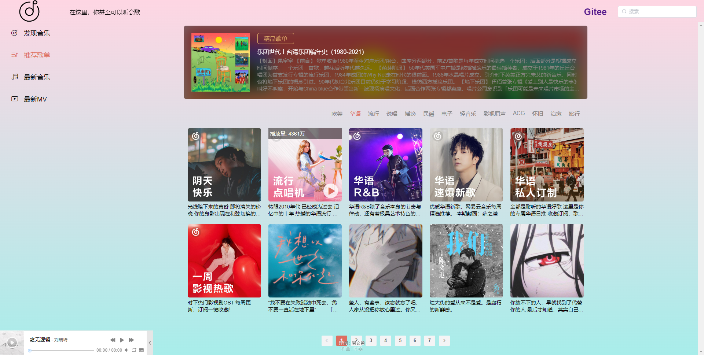

vue音乐播放器

#### 介绍
基于vue框架的音乐播放器，后端所有数据来自https://github.com/Binaryify/NeteaseCloudMusicApi

很多功能还没写，上传上来占个位置..

首先node运行后端接口，[网易云音乐 NodeJS 版 API (neteasecloudmusicapi.vercel.app)](https://neteasecloudmusicapi.vercel.app/#/)

1. 打开方式npm install

2.npm run serve
<<<<<<< HEAD

!
!
!
=======

>>>>>>> 3bbd36e4f38c516dd6fd0b80dab0a1bf17775765
